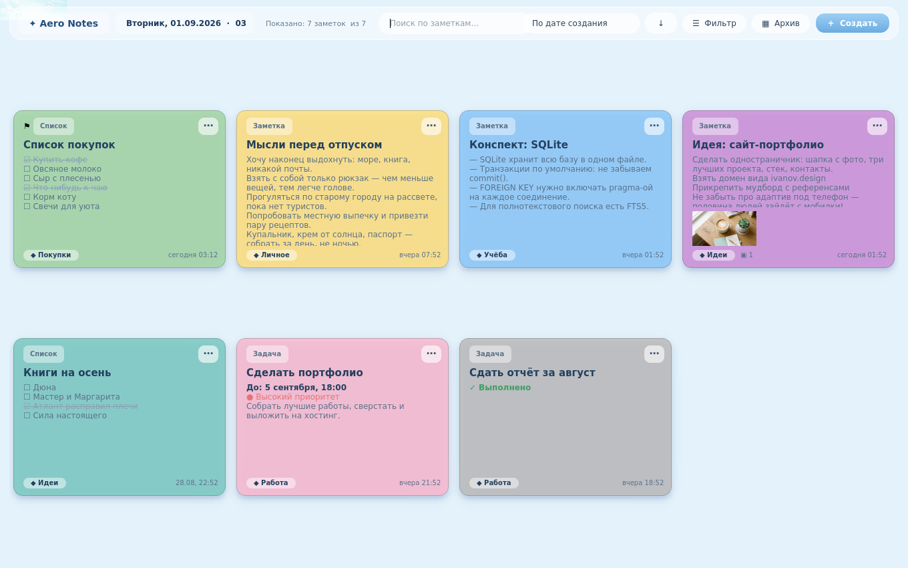
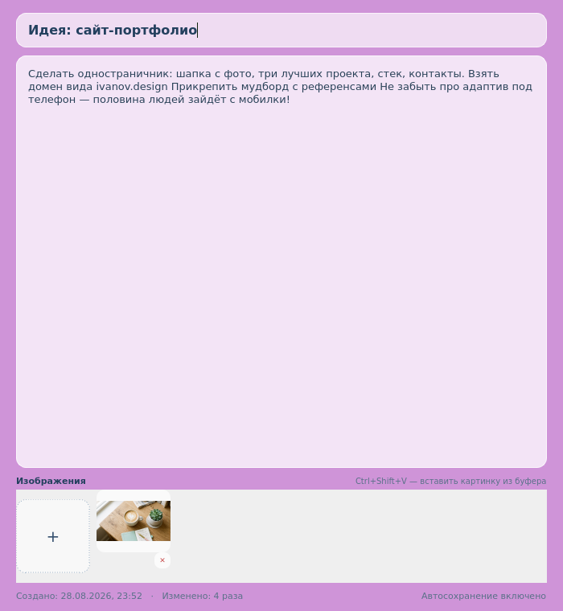
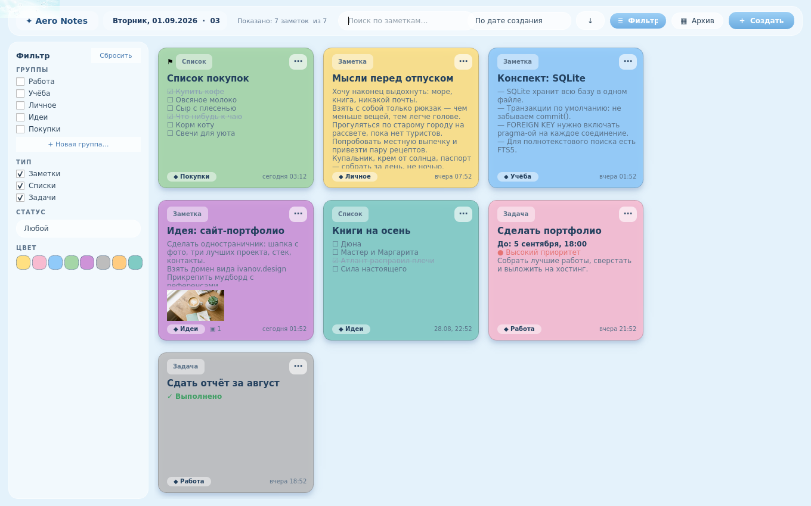
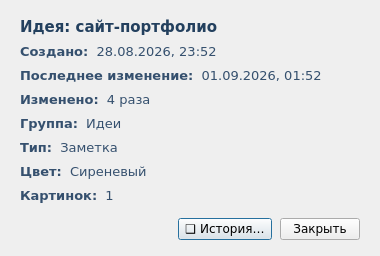

# ✦ Aero Notes — локальные заметки и задачи

Настольное приложение для ноутбука в мягком стиле **Frutiger Aero / glass UI**:
сетка цветных карточек-заметок, полупрозрачная панель сверху, живые часы и
никаких серверов — всё хранится в одном файле SQLite на вашем компьютере.



## Возможности

- **Сетка карточек** с 8 цветами: жёлтый, розовый, голубой, зелёный, сиреневый,
  серый, оранжевый, мятный.
- **Часы и дата** в левом верхнем углу — полупрозрачно, поверх обоев.
- **Три типа заметок**:
  - 📝 обычная заметка — заголовок + свободный текст + картинки;
  - ☑ список — пункты с чекбоксами (`☐ Сделать резюме`, `☑ Купить кофе`);
  - 🎯 задача — дедлайн («До: 5 сентября, 18:00») и приоритет, просроченные
    подсвечиваются красным.
- **Меню ⋯ у каждой карточки**: Сведения, Изменить цвет, Переместить в группу,
  Закрепить, Создать копию, Архивировать, Удалить.
- **Настоящая история изменений** — в «Сведениях» видно всё:
  `20:14 — создана заметка`, `21:06 — изменён текст`, `22:40 — добавлена картинка`,
  `23:37 — отмечен пункт списка`. Дата создания не меняется никогда, «Изменено: N раз»
  считает сессии правок, а не каждый символ.
- **Автосохранение**: приложение сохраняет само примерно через секунду после того,
  как вы перестали печатать. Кнопки «Сохранить» нет.
- **Закреплённые заметки** всегда сверху, независимо от сортировки.
- **Поиск** по заголовкам и содержимому — нужен уже на 100+ заметках.
- **Сортировка**: по дате создания, дате изменения, теме, цвету и статусу (+ кнопка
  направления).
- **Группы**: Работа, Учёба, Личное, Идеи, Покупки — и свои собственные.
- **Фильтры** — в отдельной маленькой раскрывающейся панели: по группам, типу,
  статусу и цвету. Главный экран не перегружается.
- **Картинки** в заметках: кнопка «+» или `Ctrl+Shift+V` из буфера обмена,
  большие автоматически сжимаются.
- **Архив** вместо корзины для ненужного, удаление — с подтверждением.

| Редактирование | Панель фильтров |
|---|---|
|  |  |

| Меню ⋯ | Сведения и история |
|---|---|
|  |  |

## Установка и запуск

Нужен Python 3.9+ (на Windows просто скачайте с python.org, отметьте «Add to PATH»).

```bash
pip install -r requirements.txt
python main.py
```

База создаётся автоматически в `data/notes.db` рядом с приложением.
При первом запуске появятся приветственные заметки-подсказки — их можно удалить.

Можно указать свой файл базы: `python main.py --db D:/notes.db`.

## Сборка .exe для Windows

Чтобы получить одиночный exe-файл, который не требует Python:

```bash
pip install pyinstaller
pyinstaller --onefile --windowed --name AeroNotes --add-data "assets;assets" main.py
```

Готовый файл появится в `dist/AeroNotes.exe`. Рядом с ним приложение создаст
папку `data/` с базой — её можно бэкапить одной копией.

## Как устроены данные

Один файл SQLite (`data/notes.db`), четыре таблицы:

- `notes` — заметки: заголовок, тип, цвет, группа, закрепление, архив, контент,
  дедлайн, приоритет, `created_at`, `modified_at`, `edit_count`;
- `groups` — группы (Работа, Учёба, …);
- `note_images` — картинки (BLOB, внутри базы — внешние файлы не потеряются);
- `history` — настоящая история изменений каждой заметки.

Правила «честных» метаданных:

- `created_at` не меняется никогда;
- `modified_at` обновляется при каждом автосохранении;
- `edit_count` растёт на **1 за одно открытие-редактирование** (сессию), а не за символ;
- закрепление/смена цвета/архив пишутся в историю, но не портят счётчик правок.

## Структура кода

```
main.py               — точка входа
app/
  db.py               — SQLite: заметки, группы, картинки, история
  models.py           — модели (Note, Group, ListItem), типы заметок
  colors.py           — пастельная палитра
  formatting.py       — русские даты, склонения («5 раз / 2 раза»)
  main_window.py      — главное окно: часы, поиск, сортировка, фильтр-панель, сетка
  note_card.py        — карточка в сетке
  editor.py           — редактор с автосохранением (3 режима) и картинками
  details_dialog.py   — «Сведения» и «История»
assets/backdrop.jpg   — обои Frutiger Aero
data/notes.db         — ваша база (в .gitignore)
```

## Горячие клавиши

- **двойной клик** по карточке — редактировать;
- **Enter** в строке списка — добавить пункт;
- **Ctrl+Shift+V** в редакторе — вставить картинку из буфера.

## Идеи на потом

- перетаскивание карточек мышью;
- выделение нескольких заметок и массовые действия;
- напоминания о дедлайнах (трей + уведомления);
- экспорт заметки в Markdown;
- тёмная тема.
